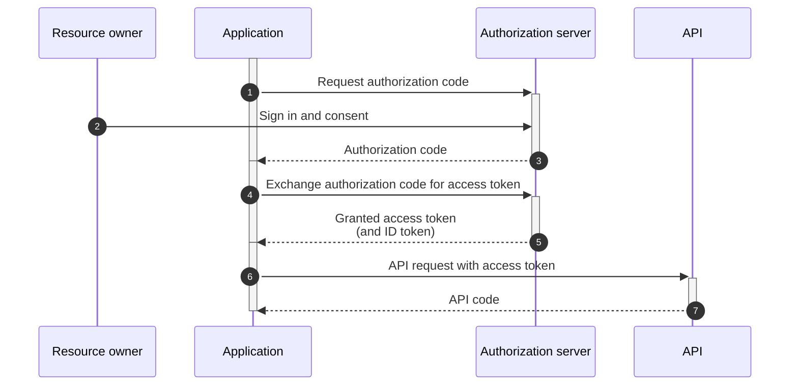
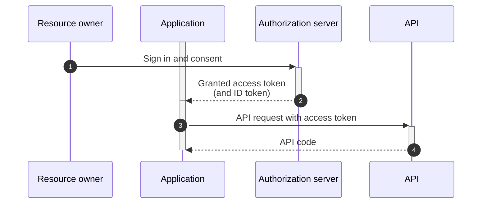
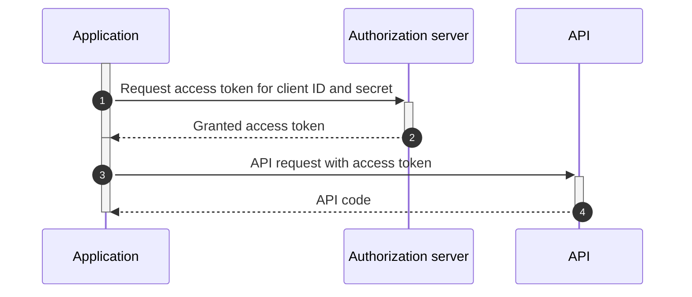

# Authentication flows

Cognite Data Fusion (CDF) uses both **[OAuth 2.0](https://oauth.net/2/)** and **[OpenID Connect](https://openid.net/connect/)** protocols to authenticate and authorize users and applications.

**Identity providers** (IdPs) issue OAuth 2.0/OIDC tokens in the JSON Web Tokens format ([JWT](https://tools.ietf.org/html/rfc7519), pronounced "jot"). Users, services, and applications are responsible for obtaining the appropriate JWT from the IdP to access the Cognite API.

The way these tokens are granted may vary, depending on the software vendor's implementation. OAuth 2.0 specifies five types of grants designed to satisfy different use cases. For CDF, the relevant grants are:

- The **[Authorization code grant](#authorization-code-grant)** and the **[Implicit grant](#implicit-grant)** (to authenticate and authorize **user applications**).
- The **[Client credentials grant](#client-credentials-grant)** and **[On behalf of](#on-behalf-of-flow)** (to authenticate and authorize **service applications**).

## Authorization code grant

This type of grant is the most commonly used in OAuth 2.0 deployments. It is geared toward a **user** (resource owner) using an application to perform some form of action that first requires authentication and authorization. The application or client can **run for an extended period** and needs both the **client credentials** AND your **interactive approval**. This flow allows the app to both get a token and a **refresh token**, and to continue to get renewed access without your approval. We refer to this OAuth2 communication flow as an **authorization code grant with PKCE**.

The diagram below illustrates the communications flow in this grant type. When Open ID Connect is implanted with OAuth 2.0, an ID token is returned along with the access token (denoted in the flow in brackets).

**Learn more:** [Microsoft identity platform and authorization code flow](https://docs.microsoft.com/en-us/azure/active-directory/develop/v2-oauth2-auth-code-flow)

## Implicit grant

In this flow, you have to interact as part of the sign-in process to approve that the application can get a token on your behalf. This token is time-limited, but the application will **NOT** get a **refresh token**. When the token expires, the application has to recheck with AAD to see if you are signed in to AAD in your browser. If not, it will prompt you to sign in again. If you are signed in, and the session has not timed out (dependent on the organization's security policies), the application will silently get another token in the background.

The implicit grant is similar to the authorization code grant with two distinct differences.

- Firstly, it is intended for user-agent-based clients (e.g., single-page web apps) that can't keep a client secret because all of the application code and storage are easily accessible.

- Secondly, instead of the authorization server returning an authorization code that is exchanged for an access token, the authorization server returns an access token.

**Learn more:** [Microsoft identity platform and implicit grant flow](https://docs.microsoft.com/en-us/azure/active-directory/develop/v2-oauth2-implicit-grant-flow)

## Client credentials grant

Use this type of grant when authentication of **system-to-system** communications is required and where a user's specific permission is not required to perform its functions. Applications must authenticate before writing data to CDF. For example, you have a Python script running locally on your computer, it’s secure, and it has a start and a stop time. However, you expect it to run for several hours, so you don’t want to sit there and wait. You also don’t want it to run as you, since it will only operate on some of the data in CDF, and you want to ensure that the script runs with the least number of privileges to avoid that something bad happens if you have made a mistake in the script.

In the client credentials grant flow , the AAD app registration gives you a **client id** and a **client secret**. You configure your application with these values, and the application interacts with the CDF project and the AAD instance to get a time-limited token. As long as you secure your script, intercepting the communications will only yield a token that is not valid for long. The Python app also gets a **refresh token** that it can use to get a new token. This can continue for days and months.

This grant type is critical to successfully implement userless software services such as extractors, as they meet the need for these applications to be able to authenticate without any user interaction (beyond the initial configuration).

**Learn more:** [Microsoft identity platform and client credentials flow](https://docs.microsoft.com/en-us/azure/active-directory/develop/v2-oauth2-client-creds-grant-flow)

## On-behalf-of flow

This flow allows an application to delegate your access for CDF to run some computation (such as a transformation or function). Because it is associated with your identity, the access will be a subset of yours, and is explicitly authorized by you.

For an application to invoke this flow:

1. You interactively start an **on-behalf-of** flow using a special API in CDF from the application. CDF will use your identity against your IdP in an OAuth2 flow and send you back an interim token called a **nonce**.

1. You must supply this nonce to the transformation or function, which will then connect to the started flow and get a token and be allowed to refresh tokens on your behalf.

The time allowed for the function or transformation to complete can vary, but you can set it to an hour, a day, or even a week or longer.

In most cases, this two-step process happens in the background for you. It is essential to understand that as opposed to the "client credentials" case, you need to be present and approve at the start of this process, and the app or script will run with your access rights, not their own like for the client credentials case.

**Learn more:** [Microsoft identity platform and on-behalf-of flow](https://docs.microsoft.com/en-us/azure/active-directory/develop/v2-oauth2-on-behalf-of-flow)
